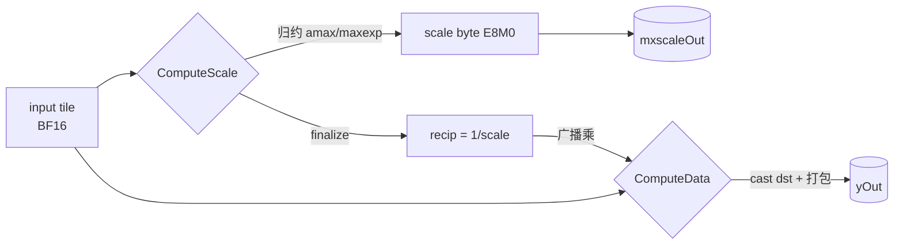
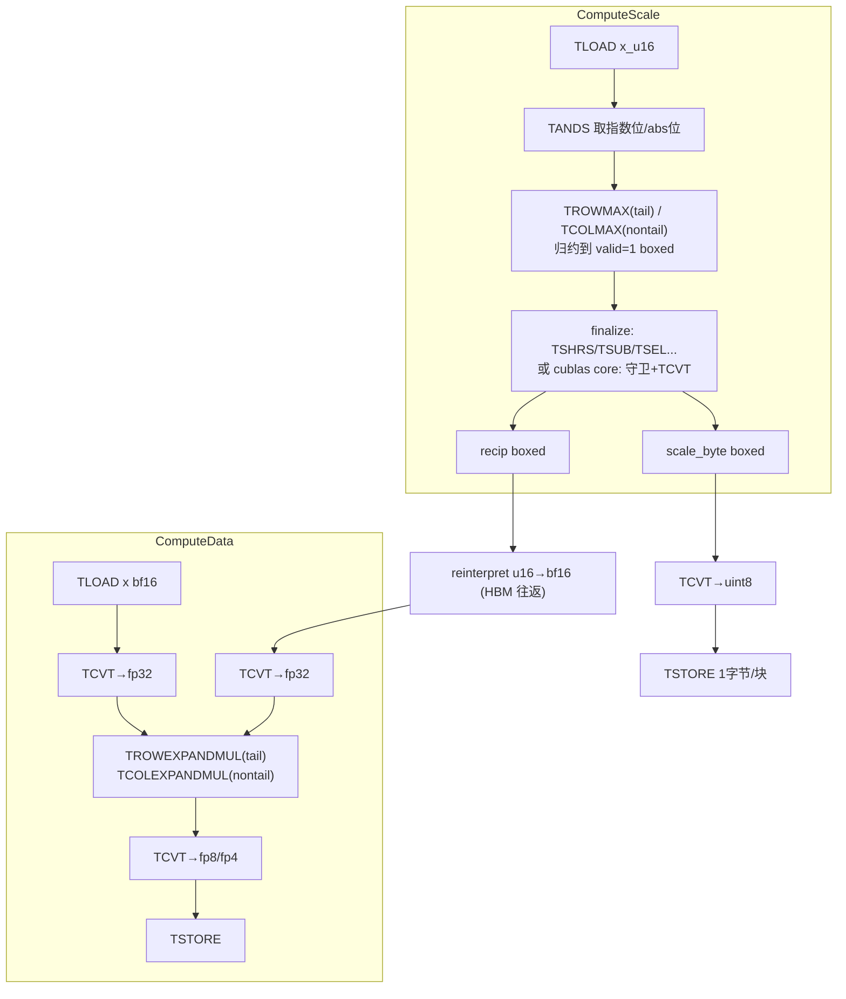

# DynamicMxQuant 计算流与计算图（供编译器 / ISA 分析指令缺口）

> **文档目的**：给编译器 / ISA 同事看清 **① 标准计算公式**、**② AscendC 实现的计算图**、
> **③ PTO-ISA 实现的计算图**，据此评估是否存在**规避当前指令缺口的新算法方案**。
> 文末第 5 节汇总了 PTO-ISA 相对 AscendC 的**指令缺口清单**——这是本文档的落点。
>
> **范围**：两种 scale 算法 × 两个量化轴 = 4 个通用场景：
>
> | 场景 | 量化轴 | scaleAlg | 合法输出 dtype |
> |------|--------|----------|----------------|
> | ①OCP-tail    | 尾轴（reduce=最后一维） | 0 OCP    | FP4_E2M1 |
> | ②cuBLAS-tail | 尾轴                    | 1 cuBLAS | FP8_E4M3 |
> | ③OCP-nontail | 非尾轴（reduce≠最后一维）| 0 OCP    | FP4_E2M1 |
> | ④cuBLAS-nontail | 非尾轴               | 1 cuBLAS | FP8_E4M3 |
>
> 输出 dtype 按 aclnnV3 合法性配对（OCP↔FP8&FP4、cuBLAS↔FP8-only、DynRange↔FP4-only）；
> 本文选各算法的代表 dtype。scaleAlg=2（DynRange，仅 FP4）结构与 OCP 同型，见附录 A。
>
> **数据类型口径**：输入 BF16（E8M7，16bit）；scale 输出 FP8_E8M0（每块 1 字节的指数）；
> 量化输出 FP8_E4M3（1 字节/元素）或 FP4_E2M1（2 元素/字节打包）。

---

## 1. 标准计算公式（aclnnV3 文档）

`aclnnDynamicMxQuantV3`：在 `axis` 上按每 `blocksize`(=k) 个元素分组，每组算一个共享缩放
`mxscale`，组内每个元素除以 `mxscale` 再按 `round_mode` cast 到 `dstType`。

**通用结构（三算法共有）**：

```
分组(axis, k=blocksize)
   → 每组求 amax = max_i(|V_i|)
   → 由 amax 算出 mxscale（E8M0，2 的幂）      ── ComputeScale
   → 每元素 P_i = cast_to_dst(V_i / mxscale, round_mode)   ── ComputeData
   → P_i 拼回 yOut；mxscale 拼回 mxscaleOut
```

`mxscaleOut` 布局约束（文档「约束说明」）：
- axis 轴上 = `ceil(x.shape[axis]/blocksize)`，再**偶数 pad**（pad 值 0，即 E8M0 字节 `0x00`，代表 `2^-127`）。
- **非尾轴：每两行数据需交织**（parity interleave），最终形状 `[ceil(numKb/2), Post, 2]`。
- 尾轴：无需交织（块沿最后一维天然连续）。

### 1.1 场景1 — OCP（scaleAlg=0，本文用 FP4_E2M1）

$$
shared\_exp = \lfloor \log_2(\max_i|V_i|) \rfloor - emax,\qquad
mxscale = 2^{shared\_exp}
$$
$$
P_i = cast\_to\_dst(V_i / mxscale,\ round\_mode)
$$

`emax` = **输出 dtype 最大正则数的指数位**（是输出类型的属性，不是自由入参）：

| DataType | emax |
|----------|------|
| FLOAT4_E2M1 | 2 |
| FLOAT4_E1M2 | 0 |
| FLOAT8_E4M3FN | 8 |
| FLOAT8_E5M2 | 15 |

### 1.2 场景2 — cuBLAS（scaleAlg=1，只涉及 FP8 类型）

将长向量按块分，每块长度为 k，对每块单独计算一个块缩放因子 $S_{fp32}^b$，再把块内所有元素用同一个
$S_{fp32}^b$ 映射到目标低精度类型 FP8。如果最后一块不足 k 个元素，把缺失值视为 0，按照完整块处理。

- 找到该块中数值的最大绝对值：
$$
Amax(D_{fp32}^b)=\max(\{|d_{i}|\}_{i=1}^{k})
$$
- 当 maxLowBound > 0 时，对最大绝对值进行下界钳位：
$$
Amax(D_{fp32}^b)=\max(Amax(D_{fp32}^b),\ maxLowBound)
$$
- 将 FP32 映射到目标数据类型 FP8 可表示的范围内，其中 $Amax(DType)$ 是目标精度能表示的最大值（FP8_E4M3 为 448）：
$$
S_{fp32}^b = \frac{Amax(D_{fp32}^b)}{Amax(DType)}
$$
- 将块缩放因子 $S_{fp32}^b$ 转换为 FP8 格式下可表示的缩放值 $S_{ue8m0}^b$。
- 从块的浮点缩放因子 $S_{fp32}^b$ 中提取无偏指数 $E_{int}^b$ 和尾数 $M_{fixp}^b$。
- 为保证量化时不溢出，对指数进行向上取整，且在 FP8 可表示的范围内：
$$
E_{int}^b = \begin{cases} E_{int}^b + 1, & \text{如果 } S_{fp32}^b \text{ 为正规数，且 } E_{int}^b < 254 \text{ 且 } M_{fixp}^b > 0 \\ E_{int}^b + 1, & \text{如果 } S_{fp32}^b \text{ 为非正规数，且 } M_{fixp}^b > 0.5 \\ E_{int}^b, & \text{否则} \end{cases}
$$
- 计算块缩放因子：$S_{ue8m0}^b=2^{E_{int}^b}$
- 计算块转换因子：$R_{fp32}^b=\dfrac{1}{fp32(S_{ue8m0}^b)}$
- 应用到量化的最终步骤，对每个块内元素：$d^i = DType(d_{fp32}^i \cdot R_{fp32}^b)$，最终输出 $\left(S^b, [d^i]_{i=1}^k\right)$，其中 $S^b$ 即 $S_{ue8m0}^b$。

（V3 新增 `maxLowBound`：`Amax = max(Amax, maxLowBound)`，仅 scaleAlg=1 生效。）

### 1.3 关键恒等式（两算法通用）

E8M0 scale 字节 `b` 表示 `2^(b-127)`；**转换因子 recip 是 scale 的精确倒数**，且本身是 2 的幂：

$$
recip = 2^{\,127-b} = 1/2^{\,b-127} = 1/mxscale
$$

因此 ComputeData 的「除以 scale」实现为「**乘以 recip**」（一次广播乘），无需除法。

---

## 2. 通用计算图（两阶段骨架）

四个场景共享同一骨架，差异集中在**归约方向/域**、**finalize 细节**、**输出 cast/打包**、**scale 交织**四处。



**四处差异点一览**（下文第 3、4 节据此展开）：

| 差异点 | OCP | cuBLAS | tail | nontail |
|--------|-----|--------|------|---------|
| 归约域 | bf16 **指数位域** (`&0x7F80`) | bf16 **abs 值域**→fp32 | — | — |
| **scale 计算位宽** | **恒 16bit**（emax 用 16bit 值；fp32 输入仅 max-exp 抽取临时 32bit，`>>16`+Pack 缩回 uint16） | **恒 32bit**（16bit maxExp 上转 fp32 算，末尾缩回 uint16） | — | — |
| 归约方向 | — | — | 沿**列**(BlockSize=最后维) | 沿**行**(BlockSize=非最后维) |
| finalize | `max_exp - emax`，clamp，`>>7`（uint16） | fp32 提 E/M，roundup 守卫，`<<7`（uint32→缩 uint16） | — | — |
| 输出 | FP4 2元素/字节打包 | FP8 1字节/元素 | — | — |
| scale 交织 | — | — | 无（平铺即最终布局） | **每两行 parity 交织** |

> **精度位宽关键点**：OCP/DynRange 的 scale finalize **恒在 16bit 域**（`ComputeScaleOcp`/`finalize_scale_recip_u16` 全 uint16，emax 用 16bit 值），即便 fp32 输入也只在 max-exp 抽取那一步临时读 32bit（`&0x7f800000`、uint32 `ReduceMax`），随即 `ShiftRights(16)+Pack` 缩回 bf16 域 uint16。cuBLAS 的 scale **恒在 32bit 域**（`intCalcType`：fp32 输入 maxExp 用 uint32，bf16/fp16 输入也把 16bit maxExp 上转到 32bit 再算 `compute_cublas_core`），末尾缩回 uint16 存 scale/recip。**两算法的 ComputeData 都提升到 fp32** 做广播乘 + cast。

---

## 3. AscendC 实现计算图（4 场景）

> 源码：`ops-nn/quant/dynamic_mx_quant/op_kernel/arch35/`。①② 直接对照本目录新增的两份权威参考文件
> `AscendC_dynamic_mx_quant_tail_axis.h`（OCP/DynRange/cuBLAS→FP4）、`AscendC_dynamic_mx_quant_tail_axis_fp8.h`（OCP/cuBLAS→FP8）。
> intrinsic 用 Ascend 向量 API 名（`Reg::And`/`Max`/`ReduceMaxWithDataBlock`/`Cast`/`Compare`/`Select`/`Interleave`/`Pack` 等）。
>
> **AscendC 三段式**（与 PTO 两阶段的对应）：**ComputeMaxExp**（归约，按输入 T 分 `Half`/`Bf16`/`Fp32` 三变体）
> → **ComputeScale**（finalize，出 scale_byte + recip）→ **ComputeData**（广播乘 + cast 打包）。前两段合起来 = PTO 的 ComputeScale 阶段。

### ① OCP-tail-FP4（`AscendC_dynamic_mx_quant_tail_axis.h`）

**ComputeMaxExpOcp**（bf16 指数位域，沿 UB 32B 块归约 → 每块 1 个 uint16 max-exp）：
```
── Bf16（ComputeMaxExpOcpBf16）──
LoadAlign(DIST_DINTLV_B16)  解交织载入对 x0,x1
  → And(x, BF16_MAX_EXP=0x7F80)   取指数位                        ×2
  → Max(x0,x1)                    相邻两半 max
  → ReduceMaxWithDataBlock        块内(32B/相邻16数)归约
  → StoreUnAlign → maxExp
── Half（ComputeMaxExpOcpHalf）── 多两步：And(FP16_INVALID)+Compare<NE> 掩 inf/nan，
   Cast<bf16>(CAST_TRUNC) 后同上，invalid 位 Select 回 expMask
── Fp32（ComputeMaxExpOcpFp32）── DIST_DINTLV_B32 两次载入 + DeInterleave；And(FP32_MX_MAX_EXP)；
   Max 链；ReduceMax；ShiftRights(FP32_PACK_SHR_NUM=16)+Pack<uint16>
   —— 仅取 max-exp 时临时读 32bit，随即 >>16+Pack 缩回 bf16 域 uint16（故 finalize 恒 16bit）
```
**ComputeScaleOcp**（恒 uint16 域）：
```
LoadAlign(maxExp)
  → Compare<NE>(maxExp, 0x7F80)           → cmpResult（inf/nan）
  → Compare<LE>(maxExp, f4Emax_=0x0100)   → invalidDataMask（≤emax）
  → Select(maxExpValue, maxExp, invalidDataMask)  clamp 到 emax
  → Sub(sharedExp, maxExp, emax)
  → ShiftRights(scale, sharedExp, BF16_SHR_NUM=7)   scale 字节
  → Select(scale, fp8NanU16=0x00FF, cmpResult)      inf→0xFF
  → StoreAlign(DIST_PACK_B16) → mxScaleOut
  ── recip ──
  → Compare<NE>(sharedExp, 0)          → zeroMask
  → Compare<EQ>(sharedExp, 0x7F00)     → specialDataMask
  → Sub(halfScale, scaleBias=0x7F00, sharedExp)
  → Select(halfScale, nanU16=0x7F81, cmpResult)    inf→NaN
  → Select(halfScale, 0, zeroMask)                 零块→0
  → Select(specialExpU16=0x0040, halfScale, specialDataMask)
  → StoreAlign → recipScale
```
**ComputeDataBf16**（bf16 域乘 + fp4 打包）：
```
LoadAlign(DIST_DINTLV_B16)  x0,x1
LoadAlign(DIST_E2B_B16)     recip（每 32B 块广播 1 标量）
  → Mul(x, recip)                 bf16 广播乘                      ×2
  → Interleave(x0,x1)             重新交织回原序
  → Cast<U=fp4_e2m1>(x, castTrait)  bf16 → FP4（round_mode 由 CastTrait）×2
  → StoreAlign(DIST_PACK4_B32) → yOut  （2 元素/字节；FP4_OUT_ELE_PER_BLK/store）
```
> Half 输入同构（先 Cast half→bf16 再乘）；rint 模式走 `ComputeDataOptimize{Half,Bf16}`：
> bf16→fp32 中间量、fp32 域乘 + `ComputeFP4FromFp32` 预处理后再 Cast→bf16→FP4，精度更高。

### ② cuBLAS-tail-FP8（`AscendC_dynamic_mx_quant_tail_axis_fp8.h`）

**ComputeMaxExpCublas**（abs 位域归约 → 每块 amax）：
```
── Bf16（ComputeMaxExpCublasBf16）──
LoadAlign(DIST_DINTLV_B16)  x0,x1
  → And(x, BF16_ABS_MASK=0x7FFF)  取 abs 位（非负 bf16 位序单调 ⇒ 等价 |值|）×2
  → Max(x0,x1); ReduceMaxWithDataBlock → 每块 uint16 amax
  → StoreUnAlign → maxExp
── Fp32（ComputeMaxExpCublasFp32）── DIST_DINTLV_B32 ×2 + DeInterleave；And(FP32_ABS_MASK)；
   Max 链；ReduceMax → 存 uint32（cuBLAS 恒 32bit，不缩位）
```
**ComputeScaleCublas**（`intCalcType` 入；fp32 域主算，末 Pack 缩 uint16）：
```
(T==float) LoadAlign(uint32,DIST_NORM) → max32
(else)     LoadAlign(uint16,DIST_UNPACK_B16) → max16; Cast<float> → max32
  → Compare<LT>(max32, FP32_MX_MAX_EXP=0x7F800000) → cmpResult（finite）
  → Compare<NE>(max32, 0)                          → zeroMask（非零块）
  → Maxs(max32, maxLowBound_)          §1.2② 下界钳位
  → Mul(max32, invMax=invDstTypeMax_=1/448)  §1.2③ S_fp32 = Amax/Amax(FP8=448)
  → ShiftRights(exp32, max32, FP32_SHR_NUM=23)    §1.2④ 无偏指数 E
  → And(man32, max32, FP32_MX_MAN_MASK=0x7FFFFF)  §1.2④ 尾数 M
  ── roundup 守卫（§1.2⑤）──
  → p0 = CompareScalar<GT>(exp,0) & <LT>(exp,FP32_NUMBER_254=254) & <GT>(man,0)   正规进位
  → p1 = CompareScalar<EQ>(exp,0) & <GT>(man,FP32_NUMBER_HALF=0x400000)  非正规(M>0.5)
  → MaskOr(p0,p1) = roundup
  → Adds(exp+1); Select(roundup? exp+1 : exp)      §1.2⑥ E 即 E8M0 字节 b
  → Select(fp8NanU32, cmpResult)  非finite→0xFF; Select(zeroU32, zeroMask)  零块→0
  → Pack<uint16>(LOWEST) → StoreAlign(DIST_PACK_B16) → mxScaleOut
  ── recip（§1.2⑦）──
  → ShiftLefts(exp, 7); Sub(halfScale, scaleBias=FP32_MX_EXP_BIAS_CUBLAS - (exp<<7))  = 1/S 位型
  → Select(nanU32=0x7F81, cmpResult); Select(zeroU32, zeroMask)
  → Pack<uint16> → StoreAlign → recipScale
```
**ComputeData**（§1.2⑧ d^i = FP8(d_fp32·R)）：
```
LoadAlign(DIST_E2B_B16) recip（bf16）
── Bf16 输入 ── LoadAlign(DIST_DINTLV_B16) x0,x1
  → Mul(x, recip)                  **bf16 域**广播乘                ×2
  → Cast<float>(ZERO/ONE) 拆 4 路   bf16→fp32（仅位宽提升，无算术）
── Fp32 输入 ── LoadAlign(DIST_DINTLV_B32)×2 + DeInterleave 4 路；CastBf16ScaleToFloat(recip)；
   Mul(x, fp32Scale) ×4（fp32 域乘）
── Half 输入 ── 先 Cast<float> 再 fp32 域乘
  → Cast<U=fp8_e4m3>(x, castTrait32to8{0,1,2,3}=SAT+RINT) 4 路 ZERO/ONE/TWO/THREE 布局
  → Add(...) 合并 4 路 → 1 字节/元素
  → StoreAlign(DIST_NORM_B8) → yOut  （256 元素/store）
```

### ③ OCP-nontail-FP4（`dynamic_mx_quant_not_tail_axis_optimize_*`）

ComputeScale/Data 数值与 ① **同**，但**归约沿行**（非最后维），且 scale 输出多一步**交织**：
```
ComputeScale：同①（OCP 指数位域），沿行归约得每列 1 个块 scale
ComputeData ：同①（bf16 乘 + fp4 打包）
── scale 交织（dynamic_mx_quant_post.h）──
for (i=1;i<blockNum;i+=2):
   Interleave(out[i-1], out[i], in[i-1], in[i])   ← 每两块行 zip
   → 布局 [scaleRows/2, Post, 2]，parity 内层
   → DataCopyPad → mxScaleOut
```

### ④ cuBLAS-nontail-FP8（`..._high_perf_large_tail.h:426-440`）

ComputeScale/Data 数值与 ② **同**，归约沿行；**且 bf16 输入分支在 uint16 abs-bit 域归约**：
```
── 归约（abs-bit 域，:426-440）──
DataCopy x0,x1（对置块）
  → And(x, 0x7FFF)     取 abs 位                                 ×2
  → Max(...) 累积       → maxU16
  → Cast<float>(maxU16) abs-bit 位型当 bf16 再转 fp32
  → 之后同 ② 的 fp32 守卫 core
ComputeData：同 ②（fp32 乘 + fp8 直转）
scale 交织：同 ③（Interleave 每两块行 zip）
```

---

## 4. PTO-ISA 实现计算图（4 场景）

> 源码：`SuperNPUBench/.../kernels/quant/dynamic_mx_quant/`。intrinsic 用 Tile-ISA 名
> （`TANDS`/`TROWMAX`/`TCOLMAX`/`TCVT`/`TSEL`/`TROWEXPANDMUL` 等）。
> 公共计算子在 `dynamic_mx_quant_common.hpp`。
>
> **两条贯穿全篇的规避手法**（见第 5 节）：
> - **位重解释无寄存器 bitcast** → 经 scratch-HBM 字节别名 `TSTORE`+`TLOAD` 往返
>   （`reinterpret_u16_to_bf16` / `reinterpret_f32_to_u32`）。
> - **比较仅 EQ（3 参 `TCMP/TCMPS`）** → 用 `TMINS/TMAXS` + 默认 EQ 模拟 `LT/GT/NE`。

### 通用两阶段（PTO 版骨架）



### ① OCP-tail-FP4（`dynamic_mx_quant_tail_ocp_fp4.hpp` + `compute_ocp_scale_tail_boxed_pw`）

```
ComputeScale (compute_ocp_scale_tail_boxed_pw)：
  TLOAD x_u16                         （bf16 位型当 uint16 载入）
  TANDS(exp_bits, x_u16, 0x7F80)      取指数位
  TROWMAX(max_exp, exp_bits)          沿列归约 → valid col=1（boxed）
  TCMPS(eq_inf, max_exp, 0x7F80)      eq_inf（EQ）
  TMAXS(max_exp, emax=0x0100)         clamp up 到 emax（≡ AscendC 的 invalid-select）
  TSUB(shared, max_exp, emax)         减 emax
  finalize_scale_recip_u16:
    TSHRS(scale, shared, 7); TSEL(eq_inf→0x00FF)
    TSUB(recip, 0x7F00, shared)
    TSEL(eq_inf→0x7F81); TSEL(shared==0→0); TSEL(shared==0x7F00→0x0040)
  TCVT(scale_u8, scale_byte) → TSTORE  1 字节/块（compact 平铺）

ComputeData：
  reinterpret_u16_to_bf16(recip → inv_bf16)   ← HBM 往返（缺 bitcast）
  TCVT(inv_scale_f, inv_bf16)                  bf16→fp32
  TLOAD(xq)；TCVT(xf, xq)  bf16→fp32
  TROWEXPANDMUL(xf, xf, inv_scale_f)           每行标量广播乘
  TCVT(oq, xf)                                 fp32 → FP4 打包（Post 减半）★
  TSTORE(gy, oq)
```
★ **输出 tile 切分**：单块 fp4 = BlockSize/2 字节（16B@BS32），不满足 32B 列对齐。
方案 = **物理宽补齐 `PW=⌈BlockSize/64⌉×64` + 每 op 列装箱到有效 BlockSize**（无 concat/配对/零块）。
详见 §6.2 与 kernel 头注释。

### ② cuBLAS-tail-FP8（`dynamic_mx_quant_tail_cublas_fp8.hpp` + `compute_cublas_scale_tail`→`compute_cublas_core`）

> **`compute_cublas_core` 逐段对照 §1.2 公式**：它的唯一职责是把一个块的 fp32 `Amax`
> 变成两样东西——① E8M0 的 `scale_byte`（即 $S_{ue8m0}^b$），② bf16 的 `recip`（即 $R_{fp32}^b$）。
> 全程不做除法：ComputeData 用「乘 recip」代替「除 scale」（§1.3 恒等式）。

```
ComputeScale (compute_cublas_scale_tail)：
  TLOAD(xq_s); TABS(abs_x, xq_s)      bf16 值域取 |d_i|                       ── §1.2 ①
  TROWMAX(max_r, abs_x)               沿列归约 → Amax=max_i|d_i|（boxed valid col=1, bf16）
  TCVT(max_f, max_r)                  每块标量 bf16→fp32（下面全程 32bit，末尾缩 uint16）
  compute_cublas_core(max_f)：        fp32 Amax → scale_byte(S_ue8m0^b) + recip(R_fp32^b)
    ── 边界掩码（先抓：TMAXS/TMULS 会改 max_f，故用钳位前位型）──
    raw = bits(max_f)                 reinterpret（缺 bitcast → HBM 往返）
    TMINS+TCMP → finite = raw<0x7F800000    非 inf/nan（模拟「<」，缺 CmpMode）
    TCMPS      → eq_zero = raw==0            整块全 0（默认 EQ）
    ── 主线：Amax → scale_byte（§1.2 ②→⑥）──
    TMAXS(max_f, maxLowBound)         ②  max_f = max(Amax, maxLowBound)
    TMULS(max_f, 1/448)              ③  max_f ← S_fp32^b = Amax / Amax(FP8_E4M3=448)
    s32 = bits(max_f)                    S_fp32^b 位型
    TSHRS(E, s32, 23)                ④  E_int^b = 偏置指数字段（bias127，同 E8M0）
    TANDS(M, s32, 0x7FFFFF)          ④  M_fixp^b = 尾数字段
    TOR(roundup, p0, p1)             ⑤  p0=(E>0 && E<254 && M>0) 正规进位
                                            p1=(E==0 && M>0x400000) 非正规(M>0.5)
    TADDS/TSEL: E ← roundup? E+1 : E ⑤⑥ E 即 E8M0 字节 b（S_ue8m0^b=2^(b-127)）
    TSEL(eq_inf→0xFF); TSEL(eq_zero→0)  scale_byte ← E（特殊块覆盖）
    ── recip = 1/S_ue8m0^b（§1.2 ⑦）──
    half ← 0x7F00 - (E<<7)              = 2^(127-E) 的 bf16 位型 = 1/S_ue8m0^b
    TSEL(eq_inf→0x7F81); TSEL(eq_zero→0)  recip ← half（inf→NaN、零块→0）
  TCVT(scale_byte→u8) → TSTORE  1 字节/块   mxscaleOut = S_ue8m0^b（E8M0）

ComputeData（§1.2 ⑧：d^i = DType(d_fp32^i · R_fp32^b)）：
  reinterpret_u16_to_bf16(recip→inv_bf16); TCVT(inv_scale_f)   R_fp32^b → fp32
  TLOAD(xq); TCVT(xf, xq)             bf16→fp32
  TROWEXPANDMUL(xf, xf, inv_scale_f)  × R_fp32^b（每行标量广播乘 ≡ 除以 S_ue8m0^b）
  TCVT(oq, xf)                        fp32 → FP8（1 字节/元素）
  TSTORE(gy, oq)
```

### ③ OCP-nontail-FP4（`dynamic_mx_quant_nontail_ocp_fp4.hpp` + `compute_ocp_scale_not_tail_boxed`）

与 ① **数值同**，归约换 `TCOLMAX`（沿行），数据乘换 `TCOLEXPANDMUL`（沿列广播）：
```
ComputeScale：TANDS(0x7F80) → TCOLMAX(沿行→valid row=1) → 同①finalize
ComputeData ：TCOLEXPANDMUL(xf, inv_scale_f) → TCVT→FP4 打包 → TSTORE
scale 输出  ：TCVT→uint8 → TSTORE  【compact 平铺 [scaleRows, Post]】
              ▲ 缺 parity 交织：AscendC 是 [ceil(numKb/2),Post,2]，此处未交织（问题5）
```

> **parity 交织举例**（非尾轴 scale 最终布局，③④ 共用）。归约后每个「块行」对每列产出 1 个 E8M0 字节。
> 设 **2 个块行 × 3 列**（Post=3）：块行0 = `a0 a1 a2`、块行1 = `b0 b1 b2`（下标为列号）。
> - **PTO 现状（compact 平铺 `[2,3]`）**：`a0 a1 a2 b0 b1 b2`——按块行顺序平铺。
> - **AscendC golden（parity 交织 `[1,3,2]`）**：`a0 b0 a1 b1 a2 b2`——每两块行**按列 zip**（同一列的 even/odd 块行相邻，parity 在最内层）。
>
> 奇数块行先**偶数 pad**（补块行 `0x00`=2^-127）再 zip：如 3 个块行→pad 到 4，按 `(0,1)`、`(2,3)` 两对分别 zip → `a0 b0 a1 b1 | c0 00 c1 00`，形状 `[2,3,2]`。
> 这一步 zip 即 `TINTERLEAVE`/`Reg::Interleave`（AscendC `DataCopy<DIST_INTLV_B8>`）；linx `-D__linx` 头未暴露该 intrinsic → PTO 停在 compact 平铺（见 §5 缺口 C / 问题5）。**尾轴无需交织**：块沿最后一维天然连续，平铺即最终布局。

### ④ cuBLAS-nontail-FP8（`dynamic_mx_quant_nontail_cublas_fp8.hpp` + `compute_cublas_scale_not_tail`）

与 ② **数值同**，归约换 `TCOLMAX`，数据乘换 `TCOLEXPANDMUL`：
```
ComputeScale：TABS → TCOLMAX(沿行 bf16 amax) → TCVT→fp32 → compute_cublas_core（同②）
ComputeData ：TCOLEXPANDMUL → TCVT→FP8 → TSTORE
scale 输出  ：compact 平铺；【同③缺 parity 交织，问题5】
```
> 注：plain 单遍在 bf16 值域直接 `TCOLMAX`（等价 AscendC 的 abs-bit 归约，非负 bf16 位序单调）；
> 大 BS 变体改用 uint16 abs-bit 域归约以精确对齐 AscendC，见 §6.1。

---

## 5. 指令缺口清单（PTO-ISA vs AscendC）

下表是 PTO-ISA 相对 AscendC **需要绕过的能力缺口**，供评估「能否换算法规避」：

| # | 缺口能力 | AscendC 怎么做 | PTO 现在怎么绕 | 代价 | RECORD |
|---|----------|----------------|----------------|------|--------|
| A | **寄存器级 reinterpret / bitcast**（位型重解释，不经内存、不做数值转换）| 寄存器内直接位重解释 | scratch-HBM 字节别名 `TSTORE`+`TLOAD` 往返 | 每次多 1 次 HBM 写+读 + 一块静态 buffer；cuBLAS 因 fp32 往返把 tile 预算从 4096 砍到 2048（放大非尾轴大 BS 无解区间）| 问题4 |
| B | **带 `CmpMode` 的 4 参 `TCMP/TCMPS`**（直接 `LT/GT/NE`）| `Compare<LT/NE/GT/EQ>` 一条到位 | `TMINS/TMAXS`(±1) + 默认 EQ 的 3 参 `TCMP` 模拟；`!=` 用 `TNOT(TCMPS)` | 每个非-EQ 比较多 1~2 条指令；cuBLAS 守卫链变长 | 问题4 |
| C | **`TINTERLEAVE`/`TDEINTERLEAVE`**（parity zip，非尾轴 scale 交织）| `Reg::Interleave` / `DataCopy<DIST_INTLV_B8>` | **无替代**——当前非尾轴 scale 输出 compact 平铺，**未交织** | 非尾轴 scale 布局**尚非 AscendC-faithful**（数值对但排布差）；LinxISA 0.57 有该 intrinsic 定义，仅 `-D__linx` 头未暴露（头封装缺口，非 ISA 缺口）| 问题5 |
| D | **fp32→fp4 cast 的 round 语义确认** | bf16 域 cast，round_mode 由 CastTrait | fp32 域乘 + `TCVT` fp32→fp4 直转 | cast tie-break 语义待 ISA/编译器确认（golden 已按 rint 对齐）| 问题6 |

**给 ISA/编译器同事的关注点**：
- **A、B 若补齐**：cuBLAS 路径可去掉 HBM 往返、切回文件内保留的 IDEAL 版（`compute_cublas_core`
  尾部注释），tile 预算回到 4096，非尾轴大 BS 无解区间自动收窄。
- **C 若补齐**（暴露 `TINTERLEAVE`）：非尾轴 scale 一步到 AscendC 最终布局，无需换算法。
- **是否有新算法规避 C**：当前 PTO 仅有 `TCONCAT` + 归约内部 butterfly shuffle，无通用 zip；
  若能用「归约阶段直接产出交织顺序」或「output stride 重排」替代显式 zip，则可绕过 C——这是最希望 ISA 侧给出方向的点。

---

## 6. 特殊场景补充说明

### 6.1 大 BlockSize（非尾轴，方案A：切分归约轴）

**动因**：非尾轴 plain kernel 单遍载入整块 `[BlockSize, TileN]`，连续轴 TileN 同时背负
**对齐下界**（fp4 `TileN%64==0`、fp8 `TileN%32==0`）与 **TileSize 上界**（`BlockSize*TileN ≤ 预算`）。
大 BS 时「下界 > 上界」无合法 TileN（ocp-fp4 BS≥96、cublas-fp8 当前 BS≥96/正式 BS≥160 失效）。

**方案A**（`*_bigbs.hpp`）：把归约行切成 `R_sub` 子块（`R_sub | BlockSize`），running-`TMAX` 跨子块累积：
```
pass1: for sub in numSub:  TANDS → TCOLMAX(子块) → TMAX 累积   （max 结合律 ⇒ 等价单遍归约）
       累加器 seed 用 uint16 TEXPANDS(0)（bf16 seed 会崩 LinxV5 后端 getCopyToParts）
pass2: reinterpret→fp32 复用 compute_cublas_core / OCP finalize；数据路径同 plain
```
TileSize 改绑 `R_sub*TileN`（`R_sub` 自由旋钮），与对齐下界**解耦** → 任意 BlockSize 可解。
cublas-bigbs 的归约走 **uint16 abs-bit 域**，与 AscendC `ComputeScaleCuBlas` bf16 分支**同域**。

### 6.2 尾轴 FP4 输出 tile 切分（列装箱补齐物理宽）

单块 fp4 输出 = `BlockSize/2` 字节，`BlockSize/2 % 32 ≠ 0` 时违反 32B 列对齐。
方案：物理宽补齐 `PW=⌈BlockSize/64⌉×64`，value/scale tile 物理 PW、有效 BlockSize，
`TROWMAX`/`TCVT` 只作用 ValidCol=BlockSize；fp4 输出 tile 物理 `PW/2` 字节（32B 对齐）、
有效 `BlockSize/2` 字节；boxed TLOAD/TSTORE 只搬 ValidCol 列 → 尾块不越界。
**无 scratch/concat/配对/零块**，仅需 `N%BlockSize==0`。另有等价备选「2-block scratch-HBM
concat + 零块」方案（`.hpp.bak`），待运行期可比对后再定选型。

### 6.3 M/N 尾块（boxed 部分 tile）

`M%TileM≠0`（尾轴）或 `N%TileN≠0`（非尾轴）时，物理 tile 形状保持 `TileM×BlockSize`
（避免 <512B tile 触发 LinxV5 `IsValidActiveSize` 溢出断言），仅把 valid 区收窄到尾块行/列数
（boxed），基址按 PHYSICAL 步长定位。`tail_cublas_fp8` / `tail_ocp_fp4` 已用此法。

---

## 附录 A：DynRange（scaleAlg=2，仅 FP4_E2M1）

结构同 OCP，差异在 finalize 的取整：对 abs 位加 `ADD_VALUE=0x003F` 再取指数位
（`ceil(log2)` 效果），`xexp<emax` 时置 emax。PTO 见 `compute_dynamic_range_scale_{tail,not_tail}`。
ttk ground-truth 对任意 fp4 实际走 OCP 路径（无独立 DynRange golden），故该配置的 golden 对齐以
OCP 为准。此配置本轮**未逐 op review**（README 状态表标「待改」）。
